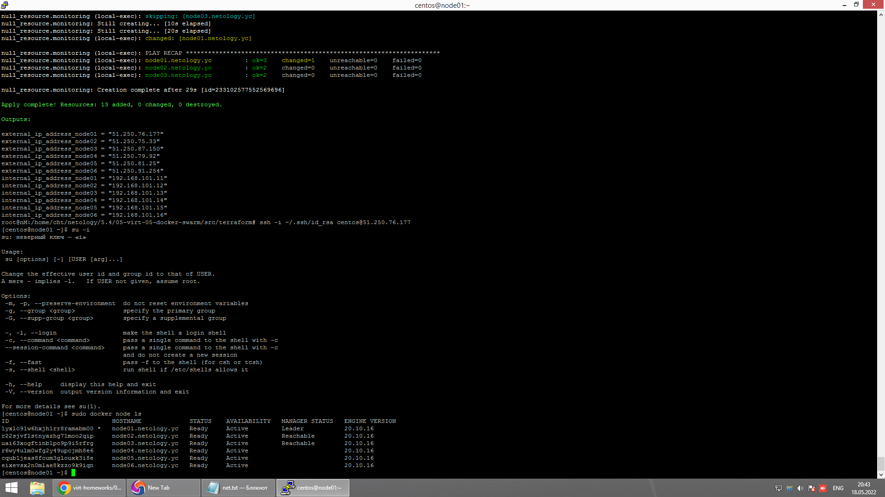
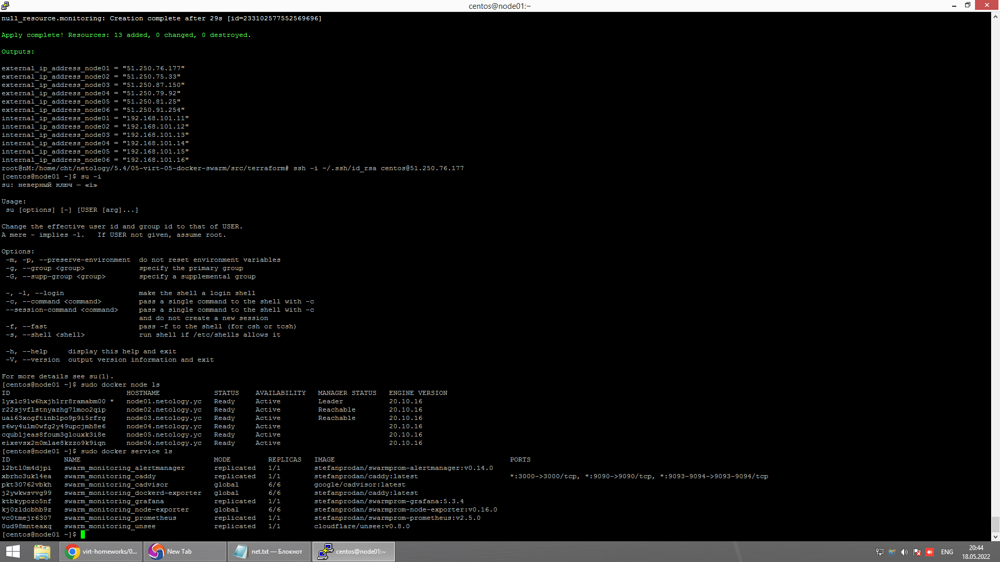

# Домашнее задание к занятию "5.5. Оркестрация кластером Docker контейнеров на примере Docker Swarm""

## 1.

- в режиме global сервис будет запущен на каждой ноде в единственном экземпляре, а в режиме replication есть возможность запускать необходимое количество экземпляров приложения и они будут равномерно распределены между всеми нодами
- в Docker Swarm кластере испольуется алгоритм поддержания распределенного консенсуса — Raft
- Overlay Network это тип сети, используемый в Docker Swarm кластере который позволяет создать свою внутреннюю сеть поверх интернета

## 2.

  

## 3.

  

