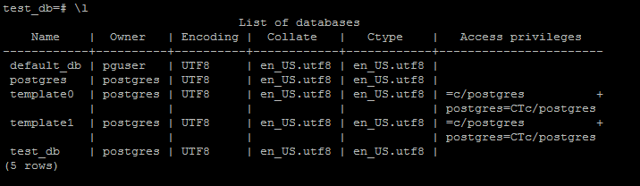
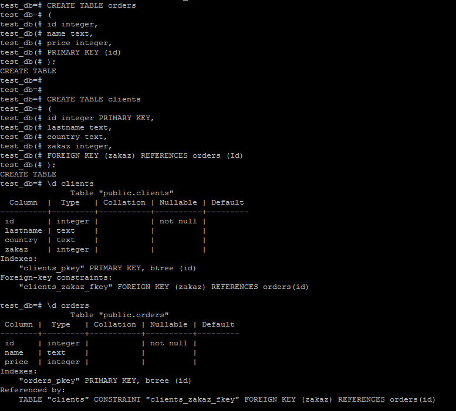
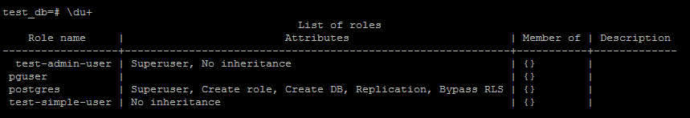
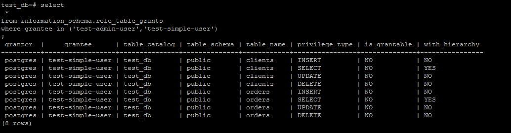

# Домашнее задание к занятию "6.2. SQL"

## 1.
```
version: '2'
services:
  postgres:
    image: centos/postgresql-12-centos7
    volumes:
      - /postgres/data:/var/lib/postgresql
      - /postgres/backups:/data/backups
    ports:
      - "5432:5432"
    environment:
      POSTGRESQL_USER: pguser
      POSTGRESQL_PASSWORD: pgpass
      POSTGRESQL_DATABASE: default_db
 ```

## 2.

<p align="center">
  
</p>
<p align="center">
  
</p>
<p align="center">
  
</p>
<p align="center">
  
</p>

## 3.

```
INSERT INTO orders VALUES (1, 'Шоколад', 10), (2, 'Принтер', 3000), (3, 'Книга', 500), (4, 'Монитор', 7000), (5, 'Гитара', 4000);
INSERT 0 5

INSERT INTO clients VALUES (1, 'Иванов Иван Иванович', 'USA'), (2, 'Петров Петр Петрович', 'Canada'), (3, 'Иоганн Себастьян Бах', 'Japan'), (4, 'Ронни Джеймс Дио', 'Russia'), (5, 'Ritchie Blackmore', 'Russia');
INSERT 0 5

SELECT COUNT (*) FROM clients;
 count
-------
     5
(1 row)


SELECT COUNT (*) FROM orders;
 count
-------
     5
(1 row)
```


## 4.
```
UPDATE  clients SET zakaz = 3 WHERE id = 1;
UPDATE  clients SET zakaz = 4 WHERE id = 2;
UPDATE  clients SET zakaz = 5 WHERE id = 3;


test_db=# SELECT * FROM clients WHERE zakaz IS NOT null;
 id |                lastname                | country | zakaz
----+----------------------------------------+---------+-------
  1 | Иванов Иван Иванович | USA     |     3
  2 | Петров Петр Петрович | Canada  |     4
  3 | Иоганн Себастьян Бах | Japan   |     5
(3 rows)
```

## 5.

```
test_db=# EXPLAIN SELECT * FROM clients WHERE zakaz IS NOT null;
                        QUERY PLAN
-----------------------------------------------------------
 Seq Scan on clients  (cost=0.00..18.10 rows=806 width=72)
   Filter: (zakaz IS NOT NULL)
(2 rows)
```

план запроса несколько моментов:
- Seq Scan это вид чтения из таблицы, в данном случае последовательное
- 0.00 время получения первой строки
- 18.10 время получения всех строк
- rows  показывает очень приблизительное количество возвращаемых строк
- width - средний размер строки в байтах
Filter: показывает по какому параметру фильтруется выборка


## 6.

```
pg_dump -U postgres test_db -f /data/backups/dump_test_db.sql
docker compose down
docker compose up -d
docker exec -it -u 0 7300b3f56b81 bash
CREATE DATABASE test_db;
psql -U postgres -d test_db -f /data/backups/dump_test_db.sql
```
