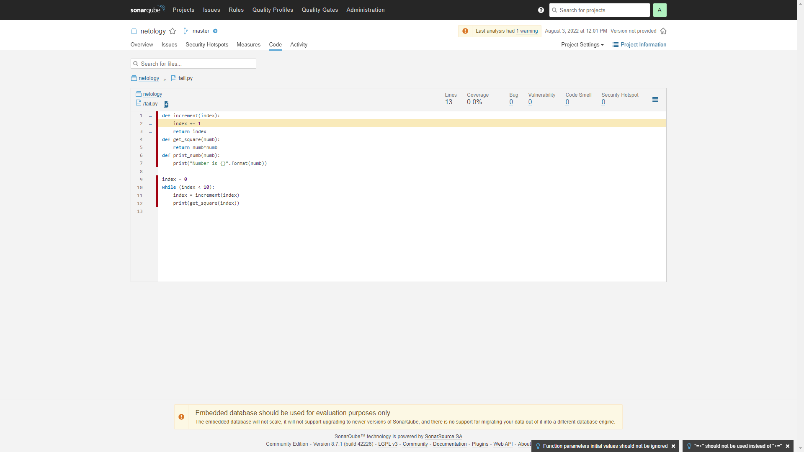
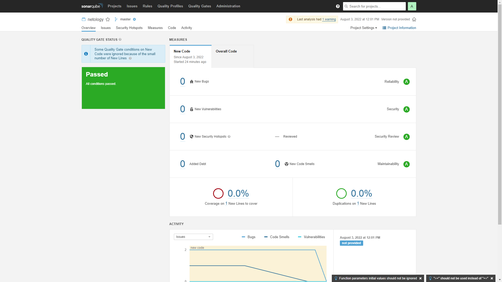
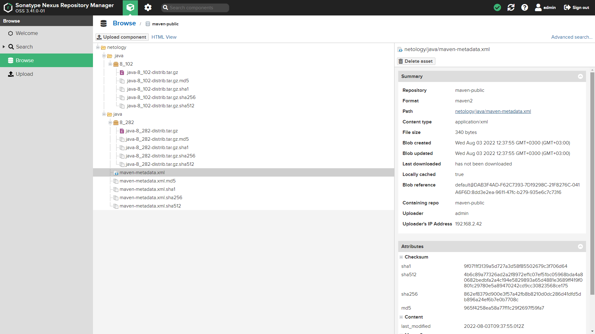

# Домашнее задание к занятию "09.02 CI\CD"

## Знакомоство с SonarQube

<p align="center">
  
</p>
<p align="center">
  
</p>


## Знакомство с Nexus

<p align="center">
  
</p>


## Знакомство с Maven

```
root@nM:/downloads/sonarqube# ll /root/.m2/repository/netology/java/8_282/
итого 20
drwxr-xr-x 2 root root 4096 авг  3 12:01 ./
drwxr-xr-x 4 root root 4096 авг  3 12:01 ../
-rw-r--r-- 1 root root  257 авг  3 12:01 java-8_282-distrib.tar.gz
-rw-r--r-- 1 root root   40 авг  3 12:01 java-8_282-distrib.tar.gz.sha1
-rw-r--r-- 1 root root  382 авг  3 12:01 java-8_282.pom.lastUpdated
-rw-r--r-- 1 root root  175 авг  3 12:01 _remote.repositories
```
